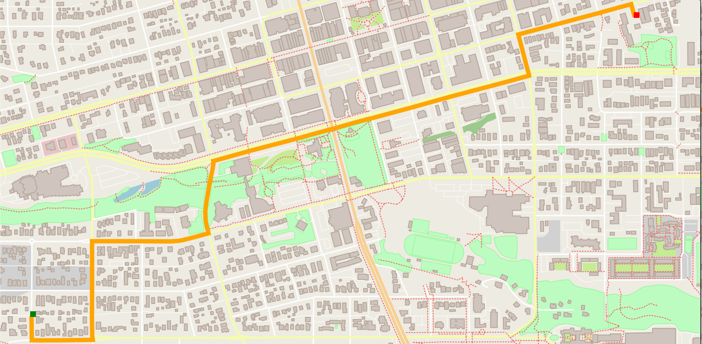

# Astar Route Planning Project using OpenStreet Map
This was a project for Udacity's C++ Nanodegree. This program uses OpenSteet map data and the IO2D library to render a path using an implementation of the [Astar](https://en.wikipedia.org/wiki/A*_search_algorithm) search algorithm. 



## Disclosure
In order to run this project locally there were some hurdles to jump over. This repo attempts to clear up any confusion regarding local installation of the IO2D library and associated dependencies. The method outlined below is tested to work with the following system:
```
MacBook Pro (15-inch, 2018)
macOS Catalina 10.15.7
2.9 GHz Intel Core i9

Visual Studio Code
```
## Cloning

When cloning this project, be sure to use the `--recurse-submodules` flag.  Using HTTPS:
```
git clone https://github.com/justinbellucci/OSM_Cxx_Astar_Search.git --recurse-submodules
```
or with SSH:
```
git clone git@github.com:justinbellucci/OSM_Cxx_Astar_Search.git --recurse-submodules
```
Delete the `P0267_Reflmpl` directory in the `thirdparty` folder. This will ensure that you have a clean copy of the IO2D library.
## Dependencies for Running Locally
* cmake = 3.17.2
  * All OSes: [click here for installation instructions](https://cmake.org/install/)
  * Set the following path: `PATH="/Applications/CMake.app/Contents/bin":"$PATH"`
* gmake = 4.3 
  * Mac: [install Xcode command line tools to get make](https://developer.apple.com/xcode/features/)
  * The most current version of `make` is installed as `gmake`. It is important to update the path to reflect this change: `PATH="/usr/local/opt/make/libexec/gnubin:$PATH"`
* gcc/g++/clang = 12.0.0
  * Mac: same instructions as make - [install Xcode command line tools](https://developer.apple.com/xcode/features/)
* IO2D  
  Installation instructions other operating systems can be found [here](https://github.com/cpp-io2d/P0267_RefImpl/blob/master/BUILDING.md). Please follow thes instructions when installing on a Mac. 
  * `cd` to `thirdparty` folder. You can clone the IO2D library by adding a submodule or simply by cloning the repo. 
    ```
    git submodule add https://github.com/cpp-io2d/P0267_RefImpl
    git submodule update --init --recursive
    ```
    or

    ```
    git clone --recurse-submodules https://github.com/cpp-io2d/P0267_RefImpl
    ```
  * Download the extra C++ standard library headers from https://releases.llvm.org/6.0.0/clang+llvm-6.0.0-x86_64-apple-darwin.tar.xz and add the flags so that these libraries can be found by IO2D. There is a lot of confusion on Udacity's Knowledge portal as to how to set the flags so I hope this helps.
    ```
    export CXXFLAGS="-nostdinc++ -isystemNEWPATH/include/c++/v1"
    export LDFLAGS="-LNEWPATH/lib -Wl,-rpath,NEWPATH/lib"
    ```
    where `NEWPATH` is the path on your local machine. The export command that I used looks like this:
    ```
    export CXXFLAGS="-nostdinc++ -isystem/Users/justinbellucci/CXX_headers/clang+llvm-6.0.0-x86_64-apple-darwin/include/c++/v1"
    ```
  * Change directory to `thirdparty/P0267_Reflmpl`
    ```
    cd thirdparty/P0267_Reflmpl
    ```
  * Comment out lines 38 to 40 in the `thirdparty/P0267-Reflmpl/CMakeLists.txt` file. 

     
  
  * Make a new directory called `Debug` and `cd` to it
    ```
    mkdir Debug && cd Debug
    ```
  * Run Cmake from the `Debug` directory. Notice the `".."` at the end. This directs Cmake to the directory above where the CMakeLists.txt file is located.
    ```
    cmake --config Debug "-DCMAKE_BUILD_TYPE=Debug" -DIO2D_DEFAULT=COREGRAPHICS_MAC ..
    ```
  * Run the build process using cmake. Notice the `"."`
    ```
    cmake --build .
    ```
  * Install the build
    ```
    make
    make install
    ```
  * `cd` to the main project directory
  
## Compiling and Running

### Compiling
To compile the project, first, create a `build` directory and change to that directory:
```
mkdir build && cd build
```
From within the `build` directory, then run `cmake` and `make` as follows:
```
cmake ..
make
```
### Running
The executable will be placed in the `build` directory. From within `build`, you can run the project as follows:
```
./OSM_A_star_search
```
Or to specify a map file:
```
./OSM_A_star_search -f ../<your_osm_file.osm>
```

## Testing

The testing executable is also placed in the `build` directory. From within `build`, you can run the unit tests as follows:
```
./test
```

